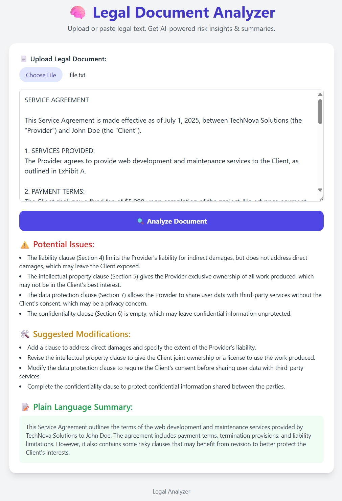

# 🧠 Legal Document Analyzer

A web-based tool that uses Groq's AI API to analyze legal documents, identify potential risks, suggest improvements, and provide plain language summaries.

## Features

- 📄 Upload or paste legal documents for analysis
- ⚠️ Identify risky or non-standard clauses
- 🛠️ Get suggestions for improvements
- 📝 Receive plain language summaries
- 🚀 Powered by Groq's LLaMA 3 70B model

## Files

- `index.html`: The main application file containing the UI and functionality
- `file.txt`: Sample legal text for testing
- `Screenshot_2-8-2025_21226_.jpeg`: Screenshot of the application interface
- `.dist/`: Distribution directory

## Getting Started

1. Clone this repository or download the files
2. Open `index.html` in your web browser
3. Upload a legal document or paste text into the text area
4. Click "Analyze Document" to process the text

## API Configuration

This application uses the Groq API with the LLaMA 3 70B model. The API key is already configured in the code, but you can replace it with your own key if needed:

1. Sign up for an account at [groq.com](https://groq.com)
2. Generate an API key from your dashboard
3. Replace the existing API key in the `index.html` file

## How It Works

The application sends the legal document to Groq's API with a specialized prompt that instructs the AI to:

1. Identify potential risks in the document
2. Suggest improvements or modifications
3. Create a plain language summary of the document

The results are displayed in an organized format on the page.